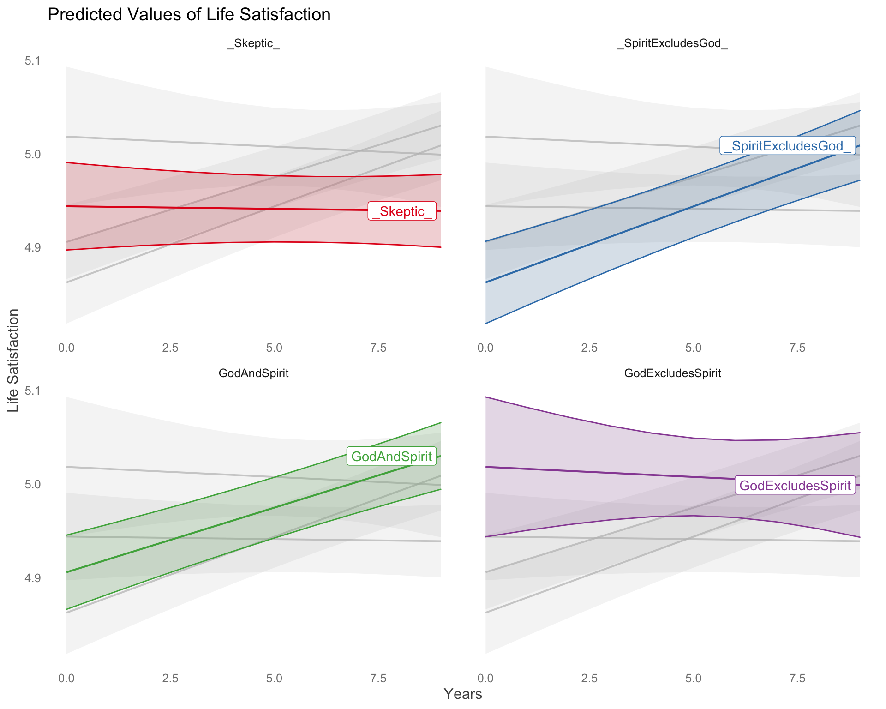

```{r include = FALSE}
library(knitr)
opts_chunk$set(
    fig.align = "center",
    root.dir = "../"
)
library("papaja")
library("tidyverse")
library("tinytex")
```

```{r load_libraries, echo=FALSE, include=FALSE}
# load libraries
library("styler")
library("tidyverse")
library("lme4")
library("ggplot2")
library("tidyr")
library("sjPlot")
library("ggeffects")
library("Amelia")
library("table1")
library("patchwork")
library("parameters")
library("prettycode")
library("gghighlight")
library("sjPlot")
library("see")
library("viridis")
library("ggpubr")
library("wesanderson")
library("ggsci")
library("here")
library("citr")
#library("furniture")
library("knitr")
library("texreg")
```
```{r load_data, include=FALSE}
ldf.5<-readRDS("~/The\ Virtues\ Project\ Dropbox/Joseph\ Bulbulia/00Bulbulia\ Pubs/2020/ldf.5") 
```
```{r data processing, cache = TRUE, dependson = "ldf.5"}
# filter only those who are measured 
dfben  <-ldf.5 %>%
  dplyr:: filter(Wave !=2009)%>% # exclude wave 1 (no spirit measures that wave)
  dplyr::filter(YearMeasured==1)%>%
  dplyr::group_by(Id) %>% filter(n() > 2)%>% # select those who have responded to at least 3 waves # Also works for 5 and 7
  dplyr::filter(n() !=0)%>%
  dplyr::ungroup(Id)%>%
  dplyr:: mutate(Years = as.numeric(years))%>%
  dplyr::mutate(Age.10yrs = (Age/10))%>%
  dplyr::mutate(Religion.Church.Log = log(Religion.Church+ 1))%>%
  dplyr::mutate(Pol.Orient.S = scale(Pol.Orient, center = TRUE, scale = TRUE),
         Age.10yrs.C = scale(Age.10yrs, center = TRUE, scale = FALSE),
         Male = factor(Gender),
         Employed = factor(Employed),
         Partner = factor(Partner),
         Edu.S = scale(as.numeric(Edu) ,scale=TRUE,center=TRUE),
         Education = as.numeric(Edu),
         Urban = factor(Urban),
         Believe.Spirit = as.factor(Believe.Spirit),
         Believe.God = as.factor(Believe.God),
         EthnicCategories = factor(EthnicCats),
         LIFESAT.S = scale(LIFESAT, center = TRUE, scale = TRUE),
         PWI.S = scale(PWI, center = TRUE, scale = TRUE),
         Deprivation.S = scale(NZdep, scale=TRUE, center=TRUE),
         Relid.C = scale(Relid, scale = TRUE,center=TRUE),
         Religious = as.factor(Religious),
         Religion.Church.Log.C = scale(Religion.Church.Log, center = TRUE, scale = FALSE))
```
```{r}
# nice labels
table1::label(dfben$Age.10yrs.C) <- "Age in Decades (C)"
table1::label(dfben$PWI) <- "Personal Wellbeing"
table1::label(dfben$LIFESAT) <- "Life Satisfaction"

table1::label(dfben$Deprivation.S) <- "Deprivation (S)"
table1::label(dfben$Pol.Orient) <- "Political Conservative"
table1::label(dfben$Pol.Orient.S) <- "Political Conservative (S)"
table1::label(dfben$NZdep) <- "NZ Deprivation Index"
dfben$Partner <- factor(dfben$Partner, labels = c("No Partner","Has Partner"))
dfben$Employed <- factor(dfben$Employed, labels = c("Not Employed","Employed"))
table1::label(dfben$Edu.S) <- "Education (S)"

# create beliefs indicator
dfben$Beliefs<- factor(ifelse(dfben$Believe.God == "Not Believe God" & dfben$Believe.Spirit == "Not Believe Spirit", "_Skeptic_", 
                                        ifelse(dfben$Believe.God == "Not Believe God" & dfben$Believe.Spirit == "Believe Spirit", "_SpiritExcludesGod_",
                                               ifelse(dfben$Believe.God == "Believe God" & dfben$Believe.Spirit == "Believe Spirit","GodAndSpirit","GodExcludesSpirit"))))
```

The relationship between spirituality and psychological well-being is a matter of enduring human fascination [@Ellsworth2010-yu]. Previous attempts to quantify the relationship between these two domains find a positiven association between spirituality and well-being [@Russinova2002-rq; @Ginsburg1995-jr; @Zaza2005-ac; @Koenig2010-gk; @Smith2003-re; @Smith2003-re; @Koenig2001-ow]. However, critics have raised three challenges.

<!-- In spirituality/psychological wellbeing research,sSsubjective in spirituality health research, psychological well-being is typically decomposed into two categories: emotional well-being (i.e., the presence or absence of positive feelings about life) and functional well-being (i.e., psychological and social well-being) [@Keyes2002-bb]. -->

First, previous research has frequently operationalised spirituality using measures of well-being. For example, The Daily Spiritual Experience Scale, which is widely used in spiritual mental health research includes items such as "I feel thankful for my blessings" and "I feel deep inner peace or harmony" to measure spirituality [@Underwood2002-hg]. As Koenig observes, it is unsurprising that well-being predicts well-being –. what Koenig describes as a  "tautology" in spirituality/mental health research [@Koenig2008-lv]. Indeed, recent systematic-review of spirituality/mental health research found that nearly 45% of previous studies investigating spirituality and emotional well-being operationalise spirituality scales using constructs for positive emotional well-being [@Garssen2016-kb]. The first challenge, then, is to define measures of spirituality that are not well-being measures reclocked in other words. 

How, then, should researchers operationalise spirituality. We can look to folk traditions for guidance. The term "spirituality" was first used to describe the religious practices of ascetics and monks. more recently, however, the term has taken on a family of broader meaning [@Swinton2001-vr]. Religion is typically operationalized to mean beliefs and practices respecting a God or gods (JB). A recurring element in the use of ‘spirituality,’ as it is distinguished from religion, is belief in a spirit or life force without commitment to a belief in a God or gods [@Hill2000-cl; @Davis2015-tx]. However, the term "spirituality" overlaps with the uses of "religion" in the sense that God or gods are instances of beliefs in spirits – that is one may be both religious and spiritual. Here we operationalize religious belief as either belief in a God or belief in both a God and a spirit or life force. We operationalize spiritual belief as either belief in a spirit or life force without any corresponding belief in a God. However, the term "spirituality" overlaps with the uses of "religion" in the sense that God or gods are instances of beliefs in spirits – that is one may be both religious and spiritual. Here we operationalize religious belief as either belief in a God or belief in both a God and a spirit or life force.  isNotably, previous spirituality mental health research has been disproportionately conducted on North American samples. In the United States, especially, samples include a majority of people who believe in both a God as well as and life forces other than God [@Smith2003-re; @Koenig2010-gk]. Although such studies drawing from such samples mightmay clarify the effects of religious spirituality on psychological subjective well-being, the question of how non-religious spirituality affects psychological well-being that is – or spiritual beliefs without any belief in a God or gods – affects subjective well-being remain unclear.  (For discussion, see: Therefore, to better understand possible distinctions between religious spirituality and non-religious spirituality for subjective well-being outcomes, samples collected from cultures outside the North Atlantic that contain a more equal ratio of the two are needed [@Garssen2016-km]). 

Third, most research investigating the relationship between spirituality and subjective well-being has relied on cross-sectional samples. These studies include high-quality reviews and meta-analyses [@Ano2005-hx; @Hackney2003-rs; @Sawatzky2005-rw; @Smith2003-re; @Visser2010-kq; @Yonker2012-zg]. However, to assess whetherto whether spiritual beliefs lead to a growth, stability, or decline in psychological well-being relative to people who lack such beliefs , including people who believe in God but not a spirit or lifeforce, requires repeatedly measuring the same individuals over time. clarify causal effects requires measuring the same individuals over time and assessing how life turns out for demographically similar people who differ in their spiritual and religious beliefs over their lifespans  and orientations [@Garssen2016-km]. 

Our study addresses these three limitations in previous research.improves on past methods the following ways: First, we avoid a tautological elision of "spirituality" and "well-being"y by adopting a non-affective measure of spirituality through use of general, non-affective measures: "Do you believe in some form of a spirit or life force?" Our measures of psychological well being are [BEN SAY HERE] and Second we adopt a four-level categorical indicator that disentangles spiritual and religious beliefs: (1) Skeptics: those who neither believe in a God nor a life force; (2) SpiritExcludeGod: those who no not believe in a God  but believe in a spirit or life force; (3) GodAndSpirit: those who believe in a God and spirit; (4) GodExcludesSpirit: those who believe in both a God and a spirit or life force "Do you believe in a god?". Second, we address the prior dependence on cross-sectional samples taken from the United States by analyzing data taken from By sampling from respondents in New Zealand, a country with [GIVE NON_RELIGIOUS SPIRITUAL STATS HERE).  Third, we are able to assess whether spirit beliefs are associate with a growth in psychological wellbeing address causation by weusing we use longitudinal responses from athis nationally diverse probability sample year over an nine-yearseight-year period with nine measurement points  to assess whether spirit beliefs lead to growth, stability, or decline in psychological well-beingwellbeing (2010 to 2018 New Zealand Attitudes and Values Study, NZAVS).

 
# Method

<!-- We rigorously assess the relationship between our non-affective measures and two constructs of subjective well-being (personal well-being and life satisfaction), adjusting for known demographic and personal influences, including age, sex, deprivation, and political orientation (Okulicz-Kozaryn, Holmes, and Avery 2014; Cuesta and Budría 2012; Røysamb et al. 2002; Hansen and Slagsvold 2012; Chen and van Ours, n.d.; Vaughan et al. 1985; Easterlin, Angelescu, and Zweig 2011; Stam et al. 2016; Yakovlev and Leguizamon 2012). Collectively, then, our approach avoids the limitations of many previous studies and helps to clarify existing literature concerning how best to study the relationship between spirituality and subjective well-being. -->


## Ethics Statement

The New Zealand Attitudes and Values Study (NZAVS) is reviewed every three years by the University of Auckland Human Participants Ethics Committee. Our most recent ethics approval statement is as follows: The New Zealand Attitudes and Values Study was approved by The University of Auckland Human Participants Ethics Committee on 03-June-2015 until 03-June-2018, and renewed on 05-September-2017 until 03-June-2021. Reference Number: 014889. Our previous ethics approval statement for the 2009-2015 period is: The New Zealand Attitudes and Values Study was approved by The University of Auckland Human Participants Ethics Committee on 09-September-2009 until 09-September-2012, and renewed on 17-February-2012 until 09-September-2015. Reference Number: 6171. All participants granted informed written consent and The University of Auckland Human Participants Ethics Committee approved all procedures.

## Sampling Procedure

The NZAVS is an annual, longitudinal national probability sample of registered New Zealand voters, which was started in 2009. The Time 10 wave of the NZAVS contained responses from 47,951 participants (17,981 retained from one or more previous waves and 29,970 new additions from booster sampling and/or unmatched participants or unsolicited opt-ins). Participants who provided an email address were also emailed and invited to complete an online version if they preferred. We offered a prize draw for participation, non-respondents were emailed and phoned multiple times, and all participants were mailed a Season’s Greetings card from the NZAVS research team and informed that they had been automatically entered into a bonus seasonal grocery voucher prize draw. We also mailed our yearly pamphlet summarizing key research findings published during the current wave of the study.

## Participants

The Time 10 (2018) wave of the NZAVS included 47,951 respondents. We analyzed data from participants who responded to our survey at least three four times between Time 2 (2010) and Time 10 (2018), resulting in a sample of N = 21,705 (N = 20,979 with complete responses).

## Measures


**Life Satisfaction** Life satisfaction is a measure of emotional well-being that was assessed using a 2-item version of the Satisfaction With Life Scale, which has previously been shown to correlate with aspects of religiosity [@Diener1985-xy]. Participants rated their agreement with the statements (a) "I am satisfied with my life"; and (b) "In most ways my life is close to ideal." The items were rated on 7-point response options ranging from 1 = strongly disagree to 7 = strongly agree. The mean Cronbach’s alpha for this 2-item scale was $\alpha$ = 0.90. Higher scores on this scale indicate higher life satisfaction. Overall scores were means of the 2-items. For detailed information pertaining to means, standard deviations, and missingness, see Table 1.

**Personal well-being** Personal well-being is a measure of function all well-being that was assessed using a 4-item version of the Australian Unity well-being Index (Cummins et al. 2017). Participants rated their satisfaction with (a) "Your standard of living"; (b) "Your health"; (c) "Your future security"; (d) "Your personal relationships." Items were rated using a 10-point response option ranging from 1 = completely dissatisfied to 10 = completely satisfied. The mean Cronbach’s alpha for this scale was $\alpha$ = 0.90. Higher scores on this scale indicate higher personal well-being. Overall scores were means of the 4-items. For detailed information pertaining to means, standard deviations, and missingness, see Table 1.


***Belief in a Spirit or a God***  We assess belief in a spirit or a God by asking two non-affective questions: "Do you believe in a spirit or life force" and "Do you believe in a god?" Responses were coded as "Belief in a spirit that excludes a god" for those who indicated a belief in both a spirit or life force and a god, "Belief that includes a god" for those who indicated a belief in a god with or without an accompanying belief in a spirit or life force, and "skeptics" for those who indicated belief in neither a spirit or life force nor a god. These items appear in the NZAVS questionnaire and were developed for the 2005 Eurobarometer. For detailed information pertaining to beliefs, see Table 1.


Table 1 about here:
\[
\begin{table}[ ht ] 
\centering 
\caption{}\label{}
\scalebox{.6}{
\begin{tabular}{ l c c c c c c c c c }
\toprule
 &   \multicolumn{ 9 }{c}{ Wave }\\ 
  & 2010 & 2011 & 2012 & 2013 & 2014 & 2015 & 2016 & 2017 & 2018 \\ 
 & n = \emph{missing} & n = \emph{missing} & n = 8547 & n = 13472 & n = \emph{missing} & n = 11687 & n = 16048 & n = 14174 & n = 14883 \\ 
 \midrule
Age &   &   &   &   &   &   &   &   &  \\ 
NZdep &   &   &   &   &   &   &   &   &  \\ 
Education &   &   &   &   &   &   &   &   &  \\ 
Employed &   &   &   &   &   &   &   &   &  \\ 
\hspace{6pt}    0 &  (\%) &  (\%) & 2094 (24.5\%) & 2955 (21.9\%) &  (\%) & 2525 (21.6\%) & 3486 (21.7\%) & 3223 (22.7\%) & 3404 (22.9\%)\\ 
\hspace{6pt}    1 &  (\%) &  (\%) & 6453 (75.5\%) & 10517 (78.1\%) &  (\%) & 9162 (78.4\%) & 12562 (78.3\%) & 10951 (77.3\%) & 11479 (77.1\%)\\ 
EthnicCategories &   &   &   &   &   &   &   &   &  \\ 
\hspace{6pt}    Euro &  (\%) &  (\%) & 6731 (78.8\%) & 11024 (81.8\%) &  (\%) & 9671 (82.8\%) & 13389 (83.4\%) & 11814 (83.3\%) & 12427 (83.5\%)\\ 
\hspace{6pt}    Maori &  (\%) &  (\%) & 1188 (13.9\%) & 1608 (11.9\%) &  (\%) & 1341 (11.5\%) & 1749 (10.9\%) & 1620 (11.4\%) & 1677 (11.3\%)\\ 
\hspace{6pt}    Pacific &  (\%) &  (\%) & 284 (3.3\%) & 339 (2.5\%) &  (\%) & 277 (2.4\%) & 331 (2.1\%) & 243 (1.7\%) & 261 (1.8\%)\\ 
\hspace{6pt}    Asian &  (\%) &  (\%) & 344 (4\%) & 501 (3.7\%) &  (\%) & 398 (3.4\%) & 579 (3.6\%) & 497 (3.5\%) & 518 (3.5\%)\\ 
Male &   &   &   &   &   &   &   &   &  \\ 
\hspace{6pt}    0 &  (\%) &  (\%) & 5302 (62\%) & 8457 (62.8\%) &  (\%) & 7325 (62.7\%) & 10148 (63.2\%) & 9011 (63.6\%) & 9433 (63.4\%)\\ 
\hspace{6pt}    1 &  (\%) &  (\%) & 3245 (38\%) & 5015 (37.2\%) &  (\%) & 4362 (37.3\%) & 5900 (36.8\%) & 5163 (36.4\%) & 5450 (36.6\%)\\ 
Partner &   &   &   &   &   &   &   &   &  \\ 
\hspace{6pt}    0 &  (\%) &  (\%) & 2408 (28.2\%) & 3546 (26.3\%) &  (\%) & 2815 (24.1\%) & 3773 (23.5\%) & 3330 (23.5\%) & 3556 (23.9\%)\\ 
\hspace{6pt}    1 &  (\%) &  (\%) & 6139 (71.8\%) & 9926 (73.7\%) &  (\%) & 8872 (75.9\%) & 12275 (76.5\%) & 10844 (76.5\%) & 11327 (76.1\%)\\ 
Pol Orient &   &   &   &   &   &   &   &   &  \\ 
Urban &   &   &   &   &   &   &   &   &  \\ 
\hspace{6pt}    Not\_Urban &  (\%) &  (\%) & 2865 (33.5\%) & 4278 (31.8\%) &  (\%) & 3951 (33.8\%) & 5538 (34.5\%) & 2610 (18.4\%) & 2661 (17.9\%)\\ 
\hspace{6pt}    Urban &  (\%) &  (\%) & 5682 (66.5\%) & 9194 (68.2\%) &  (\%) & 7736 (66.2\%) & 10510 (65.5\%) & 11564 (81.6\%) & 12222 (82.1\%)\\ 
Beliefs &   &   &   &   &   &   &   &   &  \\ 
\hspace{6pt}    \_Skeptic\_ &  (\%) &  (\%) & 2048 (24\%) & 3286 (24.4\%) &  (\%) & 2951 (25.3\%) & 4116 (25.6\%) & 3916 (27.6\%) & 4120 (27.7\%)\\ 
\hspace{6pt}    \_SpiritExcludesGod\_ &  (\%) &  (\%) & 2295 (26.9\%) & 3735 (27.7\%) &  (\%) & 3169 (27.1\%) & 4501 (28\%) & 3918 (27.6\%) & 3970 (26.7\%)\\ 
\hspace{6pt}    GodAndSpirit &  (\%) &  (\%) & 3707 (43.4\%) & 5499 (40.8\%) &  (\%) & 5119 (43.8\%) & 6453 (40.2\%) & 5464 (38.5\%) & 6210 (41.7\%)\\ 
\hspace{6pt}    GodExcludesSpirit &  (\%) &  (\%) & 497 (5.8\%) & 952 (7.1\%) &  (\%) & 448 (3.8\%) & 978 (6.1\%) & 876 (6.2\%) & 583 (3.9\%)\\ 
LIFESAT &   &   &   &   &   &   &   &   &  \\ 
PWI &   &   &   &   &   &   &   &   &  \\ 
\bottomrule
\end{tabular}
}
\end{table}
\]

 
## Demographic Indicators

**Age** Age was put into units of 10 years and centered at its mean. For detailed information pertaining to yearly means, standard deviations, and missingness, see Table 2.
Gender. Gender was assessed by asking participants if they were "Male" was coded as "1" and "Female" was coded as "0." For detailed information pertaining to yearly responses and missingness, see Table 1.

**Education**  Education level was measured using an 11-point rating developed by the New Zealand Qualification Authority known as the New Zealand Qualification Framework (NZQF; 0 = no qualification, 10 = doctoral degree). Education was centered at its mean and standardized. For detailed information pertaining to yearly means, standard deviations, and missingness, see Table 1.

**Deprivation** We measured the socio-economic status of participants’ immediate (small area) neighborhood using the 2013 New Zealand Deprivation Index, which uses aggregate census information about the residents of small neighborhood-type units to assign a decile-rank index from 1 (most affluent) to 10 (most impoverished) [@Atkinson2014-ex]. The index is based on a Principal Components Analysis of the following nine variables (in weighted order): the proportion of adults who received a means-tested benefit, household income, proportion not owning own home, proportion single-parent families, proportion unemployed, proportion lacking qualifications, proportion household crowding, proportion no telephone access, and proportion no car access. Thus, the index reflects the average level of deprivation for small neighborhood-type units (or small community areas of about 80–90 people each) across the entire country. Our sample had a mean deprivation index of 4.80 (SD = 2.79). Deprivation was centered at its mean and standardized. For detailed information pertaining to yearly means, standard deviations, and missingness, see Table 1.

**Employed** Employment status was assessed by asking participants if they were currently working, "yes" was coded as "1" and "no" was coded as "0." For detailed information pertaining to yearly responses and missingness, see Table 1.

**Partner** Participants were asked if they were in a relationship, "yes" was coded as "1" and no was coded as "0." For detailed information pertaining to yearly responses and missingness, see Table 1.

**Ethnicity** Ethnicity was assessed using four basic categories: (1) New Zealand European/Pakeha, (2) Maori, (3) Pacific Islander, and (4) Asian. For detailed information pertaining to yearly responses and missingness, see Table 1.

**Urban** People were coded as either residing in an urban "1" or rural "0" area based on New Zealand census data. For detailed information pertaining to yearly responses and missingness, see Table 1.

**Political Orientation** To assess political orientation, we asked people to rate their political orientation using seven-point response options (1 = Liberal; 7 = Conservative). Higher values indicate more conservative political beliefs. Political Orientation was standardized and centered at its mean. For detailed information pertaining to means, standard deviations, and missingness, see Table 1.

## Statistical Analyses

Statistical analysis was performed using R version 4.0.2 R version 3.6.1 (2020-06-22) 2019-07-05). We analyzed data from participants who responded to the NZAVS survey at least three four times between 2010 (Time 2) and 2018 (Time 10), resulting in a sample of  21,705 (N = 20,979 with complete responses)N = 15,040.  To model predict growth in levels of self-reported psychological subjective well-being among these participants we use generalized linear mixed models. In our models, we account for the non-linear effects of time within participants by including its interaction with both of our predictor variables: "Belief in a spirit that excludes god" and "Belief that includes a god." To handle the dependencies and heterogeneity introduced from the repeated measures, we We also included individual ID as an effect modelled as random-effect. To improve interpretability of our models, we centered and scaled the education, deprivation, and political orientation covariates. Additionally, age was centred at and put into decade-long intervals. 
The model equation(s) are described in equation 1.


\[
\begin{aligned}
\operatorname{{\small LIFESAT/PWI}}  &\sim N \left(\mu,\sigma^2 \right) \\ \mu &=\alpha_{j[i]} + \beta_{1}(\operatorname{Years}) + \beta_{2}(\operatorname{Beliefs}_{\operatorname{\_SpiritExcludesGod\_}})\ + \\
&\quad \beta_{3}(\operatorname{Beliefs}_{\operatorname{GodAndSpirit}}) + \beta_{4}(\operatorname{Beliefs}_{\operatorname{GodExcludesSpirit}}) + \beta_{5}(\operatorname{Age.10yrs.C})\ + \\
&\quad \beta_{6}(\operatorname{Deprivation.S}) + \beta_{7}(\operatorname{Edu.S}) + \beta_{8}(\operatorname{Employed})\ + \\
&\quad \beta_{9}(\operatorname{EthnicCats}_{\operatorname{Maori}}) + \beta_{10}(\operatorname{EthnicCats}_{\operatorname{Pacific}}) + \beta_{11}(\operatorname{EthnicCats}_{\operatorname{Asian}})\ + \\
&\quad \beta_{12}(\operatorname{Male}_{\operatorname{1}}) + \beta_{13}(\operatorname{Partner}_{\operatorname{Has\ }}) + \beta_{14}(\operatorname{Pol.Orient.S})\ + \\
&\quad \beta_{15}(\operatorname{Urban}) + \beta_{16}(\operatorname{Years} \times \operatorname{Beliefs}_{\operatorname{\_SpiritExcludesGod\_}}) + \beta_{17}(\operatorname{Years} \times \operatorname{Beliefs}_{\operatorname{GodAndSpirit}})\ + \\
&\quad \beta_{18}(\operatorname{Years} \times \operatorname{Beliefs}_{\operatorname{GodExcludesSpirit}}) \\ \alpha_{j} &\sim N \left(\mu_{\alpha_{j}},\sigma^2_{\alpha_{j}} \right) , \operatorname{ for  Id } j  = 1, \dots ,  J
\end{aligned}
\]


Because missing values can result in biased estimates [@Blackwell2017-oq], we multiply imputed 10 datasets using the AmeliaII package in R[@Honaker2011-yu].  We conducted a parallel analysis averaging over the multiply imputed datasets, without any substantive difference to inferences.  

## Code

All code for this analysis and a full report of the missing data imputation can be found at https://github.com/jacopastorius/NZAVS_Highland_SpiritHealth2.Table 1. Descriptive Statistics for Theoretical Variables in Each Wave. Belief in a god and belief in a spirit or life force were not measured during Wave 6 (2014). "BXG" indicates a belief in a spirit that excludes a god. "BIG" indicates a belief that includes a god. Many individuals appear in multiple waves.


Table 2. Descriptive Statistics for Demographic Variables in Each Wave. Education level was not measured during Waves 2 (2010) and 3 (2011). Many individuals appear in multiple waves.


# Results

Figure 2 about here:


```{r, cache =TRUE, include =FALSE}
# model 2
mod.1 <-lmer (PWI ~  1 +  Years * Beliefs +  Age.10yrs.C + Deprivation.S + Edu.S  + Employed + EthnicCats + Male  + Partner  + Pol.Orient.S + Urban + (1|Id), data= dfben, na.action = na.omit)
```

```{r, cache=TRUE, include=FALSE}
# model 1
mod.1 <-lmer (LIFESAT ~ 1 + Years * Beliefs+ Age.10yrs.C + Deprivation.S + Edu.S  + Employed + EthnicCats + Male  + Partner  + Pol.Orient.S + Urban + (1|Id), data= dfben, na.action = na.omit)
summary(mod.1)
```


Results for both the personal well-being and life satisfaction models are presented in Table 2 and Figure 1.

```{r fig.cap = "Combination Coefficient Plots for Personal Well-being and Life Satisfaction Spirit Belief Longitudinal Models"}
knitr::include_graphics("figs/USEcoefficientplots-1.png")
```

Table 2 about here:

\[
\begin{table}
\centering 
\caption{"Regression Models"}\label{}
\scalebox{0.6}{
\begin{tabular}{l c c}
\toprule
 & Model 1 & Model 2 \\
\midrule
(Intercept)                        & $\mathbf{6.63}^{***}$  & $\mathbf{4.94}^{***}$  \\
                                   & $(0.03)$               & $(0.02)$               \\
Years                              & $0.00$                 & $-0.00$                \\
                                   & $(0.00)$               & $(0.00)$               \\
Beliefs\_SpiritExcludesGod\_       & $\mathbf{-0.14}^{***}$ & $\mathbf{-0.08}^{***}$ \\
                                   & $(0.03)$               & $(0.02)$               \\
BeliefsGodAndSpirit                & $\mathbf{-0.16}^{***}$ & $-0.04$                \\
                                   & $(0.03)$               & $(0.02)$               \\
BeliefsGodExcludesSpirit           & $0.02$                 & $0.07$                 \\
                                   & $(0.05)$               & $(0.04)$               \\
Age.10yrs.C                        & $\mathbf{0.08}^{***}$  & $\mathbf{0.09}^{***}$  \\
                                   & $(0.01)$               & $(0.01)$               \\
Deprivation.S                      & $\mathbf{-0.14}^{***}$ & $\mathbf{-0.07}^{***}$ \\
                                   & $(0.01)$               & $(0.01)$               \\
Edu.S                              & $\mathbf{0.12}^{***}$  & $\mathbf{0.06}^{***}$  \\
                                   & $(0.01)$               & $(0.01)$               \\
Employed1                          & $\mathbf{0.09}^{***}$  & $\mathbf{0.08}^{***}$  \\
                                   & $(0.01)$               & $(0.01)$               \\
EthnicCatsMaori                    & $\mathbf{-0.30}^{***}$ & $\mathbf{-0.06}^{**}$  \\
                                   & $(0.03)$               & $(0.02)$               \\
EthnicCatsPacific                  & $\mathbf{-0.29}^{***}$ & $\mathbf{-0.08}^{*}$   \\
                                   & $(0.05)$               & $(0.04)$               \\
EthnicCatsAsian                    & $-0.08$                & $-0.04$                \\
                                   & $(0.05)$               & $(0.03)$               \\
Male1                              & $\mathbf{-0.11}^{***}$ & $\mathbf{-0.19}^{***}$ \\
                                   & $(0.02)$               & $(0.01)$               \\
Partner1                           & $\mathbf{0.61}^{***}$  & $\mathbf{0.42}^{***}$  \\
                                   & $(0.02)$               & $(0.01)$               \\
Pol.Orient.S                       & $\mathbf{0.02}^{***}$  & $\mathbf{0.01}^{**}$   \\
                                   & $(0.01)$               & $(0.00)$               \\
UrbanUrban                         & $\mathbf{-0.02}^{*}$   & $\mathbf{-0.02}^{*}$   \\
                                   & $(0.01)$               & $(0.01)$               \\
Years:Beliefs\_SpiritExcludesGod\_ & $\mathbf{0.02}^{**}$   & $\mathbf{0.02}^{***}$  \\
                                   & $(0.00)$               & $(0.00)$               \\
Years:BeliefsGodAndSpirit          & $\mathbf{0.02}^{***}$  & $\mathbf{0.01}^{***}$  \\
                                   & $(0.00)$               & $(0.00)$               \\
Years:BeliefsGodExcludesSpirit     & $0.00$                 & $-0.00$                \\
                                   & $(0.01)$               & $(0.01)$               \\
\midrule
AIC                                & $248580.18$            & $200599.16$            \\
BIC                                & $248775.08$            & $200793.96$            \\
Log Likelihood                     & $-124269.09$           & $-100278.58$           \\
Num. obs.                          & $79270$                & $78888$                \\
Num. groups: Id                    & $20979$                & $20972$                \\
Var: Id (Intercept)                & $1.78$                 & $0.88$                 \\
Var: Residual                      & $0.74$                 & $0.42$                 \\
\bottomrule
\multicolumn{3}{l}{\scriptsize{$^{***}p<0.001$; $^{**}p<0.01$; $^{*}p<0.05$}}
\end{tabular}
}
\end{table}
\]


```{r, echo = FALSE, include=FALSE}
te00 <-texreg::extract(
  mod.1,
  level = 0.95,
  include.random = TRUE,
  include.rsquared = T,
  include.nobs = T,
  include.loo.ic = T,
  include.waic = F)
texreg(list(te00),
                custom.model.names = c("PWI"),
                caption = "Personal Wellbeing",
                sideways = F,
                scalebox = .5,
                #fontsize= "footnotesize",
                label = "tab:REGRESS_1",
                ci.force.level = 0.95, bold = 0.05,
                settingstars = 0,
                booktabs = TRUE,
                custom.note ="")
```


## Personal Well-Being

We fitted a linear mixed model (estimated using REML and nloptwrap optimizer) to predict personal well-being (PWI) with Years (0-9), Beliefs (four categories), Age.10yrs.C, Deprivation.S, Edu.S, Employed, EthnicCats, Male, Partner, Pol.Orient.S and Urban, with  Id as random effects. The model included Id as random effects.  The model's intercept, corresponding to Years = 0, Beliefs = Skeptic, Age = (sample mean), Deprivation.S = (sample mean), Edu.S =(sample mean), Employed = Not Employed, EthnicCats = Euro, Male = Not Mail, Partner = No Partner, Pol.Orient.S = (sample mean),, Urban = Not Urban and Id = 2, is at 4.94 (SE = 0.02, 95% CI [4.89, 4.99], p < .001) is at 6.63 (SE = 0.03, 95% CI [6.57, 6.70], p < .001). Within this model:

  - The effect of Years is positive is not reliable (beta = 2.66e-03, SE = 3.58e-03, std. beta = 3.19e-03, p = 0.458).  We infer that Skeptics personal well-being is not increasing in the Skeptic population
  - The effect of Beliefs_SpiritExcludesGod_is reliably negative (beta = -0.14, SE = 0.03, std. beta = -0.03, p < .001). We infer that overall the population that believes in a Spirit but does not believe in a God is expected to have a lower personal well-being than skeptics. 
  - The effect of BeliefsGodAndSpirit is reliably negative (beta = -0.16, SE = 0.03, std. beta = -0.02, p < .001). We infer that overall the population that believes in God and a spirit or life force is expected to have a lower Personal Well-being than skeptics. 
  - The effect of BeliefsGodExcludesSpirit is not reliably different from the skeptic population (beta = 0.02, SE = 0.05, std. beta = 0.02, p = 0.669).
  - The effect of Age.10yrs.C is reliably positive  (beta = 0.08, SE = 7.38e-03, std. beta = 0.07, p < .001). Older people have greater personal well-beingwellbeing.
  - The effect of Deprivation.S is reliably negative (beta = -0.14, SE = 7.50e-03, std. beta = -0.08, p < .001). Deprived people have lower personal well-beingwellbeing.
  - The effect of Edu.S is reliably positive  (beta = 0.12, SE = 8.74e-03, std. beta = 0.07, p < .001). Educated people greater personal well-beingwellbeing
  - The effect of Employed is reliably positive  (beta = 0.09, SE = 0.01, std. beta = 0.05, p < .001). Employed people have greater personal well-beingwellbeing.
  - The effect of EthnicCatsMaori is reliably negative (beta = -0.30, SE = 0.03, std. beta = -0.18, p < .001).
  - The effect of EthnicCatsPacific is reliably negative (beta = -0.29, SE = 0.05, std. beta = -0.17, p < .001).
  - The effect of EthnicCatsAsian is not reliable (beta = -0.08, SE = 0.05, std. beta = -0.05, p = 0.089).
  - The effect of Male is reliably negative (beta = -0.11, SE = 0.02, std. beta = -0.06, p < .001).
  - The effect of Having a Partner is reliably positive (beta = 0.61, SE = 0.02, std. beta = 0.37, p < .001).
  - The effect of Pol.Orient.S is reliably positive  (beta = 0.02, SE = 5.67e-03, std. beta = 0.01, p < .001).
  - The effect of Urban is reliably negative (beta = -0.02, SE = 0.01, std. beta = -0.01, p < .05).
  
**Interactions**

```{r fig.cap = "Combination Coefficient Plots for Personal Well-being and Life Satisfaction Spirit Belief Longitudinal Models"}
knitr::include_graphics("Figs/USEPWI_expected-1.png")
```
  - The effect of Years X Beliefs_SpiritExcludesGod_ is reliably positive  (beta = 0.02, SE = 4.86e-03, std. beta = 0.02, p < .01). We infer that, unlike the skeptic population, people with beliefs in a spirit or life force who do not believe in a God tend to grow in their personal well-beingwellbeing over time.
  - The effect of Years X BeliefsGodAndSpirit is reliably positive  (beta = 0.02, SE = 4.41e-03, std. beta = 0.03, p < .001). We infer that people who believe in a spirit or life force who also believe in a God tend to grow in their personal well-beingwellbeing over time
  - The effect of Years X BeliefsGodExcludesSpirit is not reliable(beta = 1.96e-03, SE = 8.29e-03, std. beta = 2.36e-03, p = 0.813).  Although people who believe in a God but do not believe in a spirit or Life Force tend to have greater personal well-beingwellbeing than those who do not believe in a spirit or life force  (and greater life satisfaction than Skeptics)  this population is not expected to grow in Life Satisfaction over time. 


## Life Satisfaction 

We fitted a linear mixed model (estimated using REML and nloptwrap optimizer) to predict Life Satisfaction (LIFESAT) with Years (0-9), Beliefs (four categories), Age.10yrs.C, Deprivation.S, Edu.S, Employed, EthnicCats, Male, Partner, Pol.Orient.S and Urban, with  Id as random effects. Standardized parameters were obtained by fitting the model on a standardized version of the dataset.The model's total explanatory power is substantial (conditional R2 = 0.69). The model's intercept, corresponding to Years = 0, Beliefs = Skeptic, Age = (sample mean),, Deprivation.S = (sample mean), Edu.S =(sample mean), Employed = Not Employed, EthnicCats = Euro, Male = Not Mail, Partner = No Partner, Pol.Orient.S = (sample mean), Urban = Not Urban and Id = 2, is at 4.94 (SE = 0.02, 95% CI [4.89, 4.99], p < .001). Within this model:

  - The effect of Years is not reliable (beta = -5.50e-04, SE = 2.69e-03, std. beta = -9.32e-04, p = 0.838).  We do not infer growth over time in Life Satisfaction among the Skeptic population
  - The effect of BeliefsSpiritExcludesGod  is reliably negative (beta = -0.08, SE = 0.02, std. beta = 0.01, p < .001). We infer that overall the population that believes in a Spirit but does not believe in a God is expected to have a lower Life Satisfaction than skeptics. 
  - The effect of BeliefsGodAndSpirit is not reliable (beta = -0.04, SE = 0.02, std. beta = 0.04, p = 0.105). We do not infer growth over time in Life Satisfaction among this (Skeptic) population
  - The effect of BeliefsGodExcludesSpirit is reliably positive (beta = 0.07, SE = 0.04, std. beta = 0.05, p = 0.062).We infer that overall the population that believes in a God but does not believe in a spirit is not reliably different from  the Skeptics population in Life Satisfaction. 
  - The effect of Age.10yrs.C is reliably positive (beta = 0.09, SE = 5.26e-03, std. beta = 0.10, p < .001). Older people have greater Life Satisfaction
  - The effect of Deprivation.S is  is reliably negative (beta = -0.07, SE = 5.50e-03, std. beta = -0.06, p < .001). People who are more deprived have lower Life Satisfaction.
  - The effect of Edu.S is reliably positive (beta = 0.06, SE = 6.33e-03, std. beta = 0.05, p < .001). Educated people have greater Life Satisfaction
  - The effect of Employed is reliably positive (beta = 0.08, SE = 9.69e-03, std. beta = 0.07, p < .001). People who are employed tend to have greater Life Satisfaction
  - The effect of EthnicCatsMaori is reliably negative (beta = -0.06, SE = 0.02, std. beta = -0.05, p < .01).  People who belong to the minority Maori group tend to have lower Life Satisfaction.
  - The effect of EthnicCatsPacific is reliably negative (beta = -0.08, SE = 0.04, std. beta = -0.07, p < .05).  People who belong to the minority Pacific peoples group tend to have lower life satisfaction.
  - The effect of EthnicCatsAsian is not reliably different from people of European ethnicity in life satisfaction(beta = -0.04, SE = 0.03, std. beta = -0.03, p = 0.223).
  - The effect of Male is reliably negative (beta = -0.19, SE = 0.01, std. beta = -0.16, p < .001).
  - The effect of HasPartner is reliably positive (beta = 0.42, SE = 0.01, std. beta = 0.35, p < .001).
  - The effect of Pol.Orient.S is reliably positive (beta = 0.01, SE = 4.23e-03, std. beta = 0.01, p < .01).
  - The effect of Urban is reliably negative (beta = -0.02, SE = 8.85e-03, std. beta = -0.02, p < .05).
  
**Interactions**

```{r fig.cap = "Prediction Plot Life Satisfaction Spirit Belief Longitudinal Models"}

```
  - The interaction of Years X Beliefs_SpiritExcludesGod_ is reliably positive (beta = 0.02, SE = 3.66e-03, std. beta = 0.03, p < .001). We infer that, unlike the Skeptic population, people with beliefs in a Spirit or Life Force who do not believe in a God tend to grow in their Life Satisfaction over time.
  - The interaction of Years X BeliefsGodAndSpirit is reliably positive (beta = 0.01, SE = 3.32e-03, std. beta = 0.02, p < .001). We infer that people who believe in a spirit or life force who also believe in a God tend to grow in their Life Satisfaction over time
  - The effect of Years X BeliefsGodExcludesSpirit is not reliable (beta = -1.59e-03, SE = 6.25e-03, std. beta = -2.70e-03, p = 0.799).  Although people who believe in a God but do not believe in a spirit or Life Force tend to have greater life satisfaction than those who do not believe in a Spirit or life force  (and greater life satisfaction than Skeptics)  this population is not expected to grow in Life Satisfaction over time. 


<!-- ```{r} -->
<!-- knitr::include_graphics("Figs/Usecoefficientplots-1.png") -->
<!-- ``` -->


Figure 2. Subjective Well-being Predicted Probabilities for Belief in a Spirit or Life Force Over Time in a Listwise Deleted Dataset.

Table 3. Subjective Well-being Coefficient Table for Belief in a Spirit or Life Force. Age was put into units of 10 years and centered at its mean. Education, Deprivation, and Political Orientation were centered at their means and standardized. 

# Discussion

The purpose of this study has been to clarify the relationship between belief in a spirit/life force and psychological well-being. Spirituality as a distinct category, separate from religion, is a little-studied phenomenon in the psychology of religion literature. 

These findings demonstrate the importance ofinvestigating spiritual beliefs as a domain of interest in its own right. In many Western countries, people are increasingly identifying as "spiritual but not religious" [@Zinnbauer2005-vz; @Swinton2001-vr]. Other studies find that those who have a spiritual understanding of life without a religious framework are at an increased risk of having mental disorders [@King2013-cg]. As such, it is important to understand the ramifications of belief in a spirit for psychological health. 
To assess the relationship between a belief in a spirit or life force and subjective well-being, we improve upon past methods in three ways. 

Our findings support critiques of the reliability of past methods. The majority of studies have found positive relationships between religion and spirituality and subjective well-being. These previous studies primarily use samples taken from within the North Atlantic region and are cross-sectional in design (Ano and Vasconcelles 2005; Hackney and Sanders 2003; Sawatzky, Ratner, and Chiu 2005; Smith, McCullough, and Poll 2003; Visser, Garssen, and Vingerhoets 2010; Yonker, Schnabelrauch, and Dehaan 2012). However, our results find a negative association between both belief in a spirit or life force that excludes a god (BXG) and belief that includes a god (BIG). These longitudinal results persist independent of time. Notably, our findings do partially support other previous work that shows that spirituality outside of a religious framework is associated with worse emotional well-being, though we also find a negative association within a religious framework (King et al. 2013). Still, further research is needed to determine if other aspects of religion and spirituality, such as practices and rituals, might yield different results. 

Despite the opposition of our findings to those of many previous studies, there is room for agreement. We show that over time both "BXG" and "BIG" are associated with marginally better subjective well-being. As seen in Figure 2., both "BXG" and "BIG" predict marginally higher personal well-being and life satisfaction as time progresses. So, while those who adhere to these beliefs may start out below their skeptic counterparts in terms of their subjective well-being, they do eventually catch up. We also find that their life satisfaction is actually improving at a greater rate than skeptics. Thus, in the long term, both sustained "BXG" and "BIG" may actually be associated with better subjective well-being.
Our results also help to clarify the relationship among religion, spirituality, and subjective well-being outcomes. BXG and BIG performed almost identically in terms of their ability to predict subjective well-being outcomes. This trend suggests that any kind of existential belief - regardless of whether a god is involved - might affect subjective well-being in much the same way. This result is good news as increasing numbers of individuals continue to report spiritual but not necessarily religious beliefs. 

Taken as a whole, our results cannot refute the entire narrative of the positive relationship between spirituality and emotional well-being. First, our analysis focuses only on belief. While belief is an important part of spirituality it is not by any means spirituality itself. Individuals may identify as spiritual without any accompanying belief in a spirit or life force. Moreover, practices and rituals associated with different forms of spirituality that were not tested in this study may have large effects. Second, despite flawed methods, past studies may still be accurate. New Zealand is a largely secular country, so belief in a spirit or life force may have different impacts on subjective well-being outcomes in this context than in other, more religious contexts. Overall, though, our findings add to the existing literature, helping to untangle the multifaceted relationship among religion, spirituality, and subjective well-being. 

## Limitations

This article makes useful contributions to the continued debate regarding the relationship between religion and spirituality and mental health outcomes, but it is important to acknowledge several limitations. First, we relied upon self-reported data from the NZAVS. Although this is an accurate method for measuring belief in a spirit or life force, it may be a less accurate manner of measuring subjective well-being. It is possible that self-administration of our emotional well-being (personal well-being and life satisfaction) scales could result in mismeasurement. Second, we may not capture the full range spiritualities, which likely extend beyond belief and might even be inherently emotional. Thus, while our method avoided tautology, it might have also excluded participants who consider themselves to be spiritual but do not subscribe to a belief in a spirit or life force. 


### Authors contributions
CS leads and manages the NZAVS, and collected the data for this study. BH and JB conceived
of the study. BH wrote the first draft of the manuscript and performed the analysis with input from JB. BH conducted background research and scientific literature review. All authors contributed substantially to the intellectual content of the study and the final manuscript.

### Funding statement
The New Zealand Attitudes and Values Study is supported by a grant from the Templeton
Religion Trust (TRT0196). The funders had no role in the preparation of the article or the
decision to publish.


# Supplemental Material
S1. Statistical Analysis in R
Statistical analysis was performed using R version 3.6.1 (2019-07-05). Platform: x86_64-w64-mingw32 (64-bit), running under: Windows 10 (Action of the Toes). Generalized Linear Mixed Models were generated using the glmmTMB (Brooks et al. 2017; Knowles and Frederick 2019) package in R. In addition, we used the following R packages: dplyr (Hadley Wickham et al. 2019), tidyr (H. Wickham and Henry 2019), sjPlot (D. Lüdecke 2020), ggeffects (Daniel Lüdecke 2018), table1  and their dependencies.
Tables and coefficient plots were generated using the glmmTMB, ggeffects, and sjPlot packages in R. Models for both subjective well-being variables used family = gaussian, assuming a normal distribution. We ran each individual’s unique ID as a random-effect. The tab_model and plot_model commands in sjPlot allowed for the creation of tables and coefficient plots. Predicted probability plots were generated using the ggpredict command in the ggeffects package. The table1 package in R was used for the creation of descriptive statistics tables. 


\newpage


# References

\begingroup
\setlength{\parindent}{-0.5in}
\setlength{\leftskip}{0.5in}

<div id="refs" custom-style="Bibliography"></div>
\endgroup
