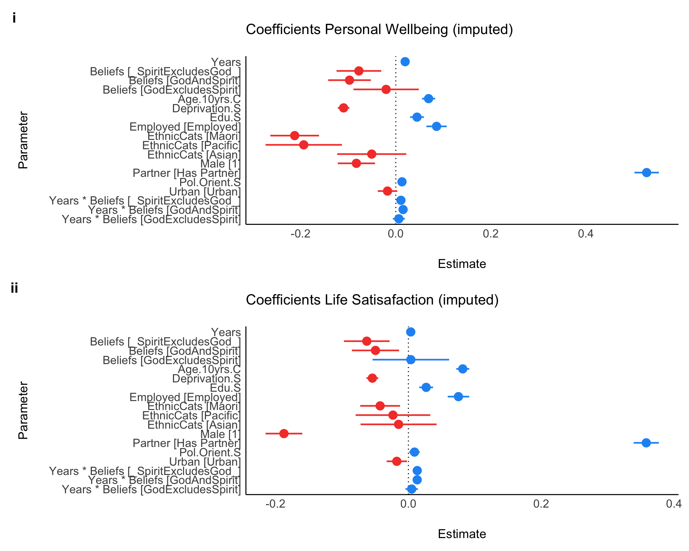

```{r libraries}
library("tidyverse")
library("papaja")
library("here")
```

```{r runanalysis, include = FALSE}
source('short.R')
```
The relationship between spirituality and psychological well-being is a matter of enduring fascination [@Ellsworth2010-yu]. Most previous attempts to quantify the relationship between these two domains find a positive association: spirituality predicts well-being [@Russinova2002-rq; @Ginsburg1995-jr; @Zaza2005-ac; @Koenig2010-gk; @Smith2003-re; @Koenig2001-ow]. However, critics have raised three credible challenges.

<!-- In spirituality/psychological wellbeing research, subjective in spirituality health research, psychological well-being is typically decomposed into two categories: emotional well-being (i.e., the presence or absence of positive feelings about life) and functional well-being (i.e., psychological and social well-being) [@Keyes2002-bb]. -->

First, previous research has frequently operationalised spirituality using measures of well-being. For example, The *Daily Spiritual Experience Scale*, which is widely used in spiritual mental health research, includes items such as "I feel thankful for my blessings" and "I feel deep inner peace or harmony" to measure spirituality [@Underwood2002-hg]. As Koenig observes, it is unsurprising that spirituality predict well-being when the same items are used to measure both constructs. Koenig aptly describes this approach as "tautological" [@Koenig2008-lv]. Indeed, recent systematic-review of spirituality/mental health research found that nearly 45% of previous studies employ tautological scales [@Garssen2016-kb]. The first challenge, then, is to define measures of spirituality that are not well-being measures dressed up in other words. 

A second challenge is to disentangle concepts of spirituality from concepts of religion. The term "spirituality" was first used to describe the religious practices of ascetics and monks, however, more recently, the term has taken on a broader family of meanings [@Swinton2001-vr]. Spirituality and health research does not converge on a unique set of meanings from the wider universe of popular meanings. Although it is commonplace across most areas of psychological science for researchers to explore different operationalisations of focal concepts, the psychology of spirituality has mostly been conducted with cross-sectional North American samples among participants who affiliate with traditional religion [@Ano2005-hx; @Hackney2003-rs; @Sawatzky2005-rw; @Smith2003-re;  @Visser2010-kq; @Yonker2012-zg]. As such, the extent to which the psychology of spirituality and health has repeated or extended the psychology of religion and health remains unclear. Notably, researchers who have operationalised spirituality constructs as distinct from religion constructs have observed a negative association between spirituality and subjective well-being [@King2013-cg]. Thus to infer how spirituality affects subjective well-being, it is important to disentangle the concepts of spirituality from concepts of religion, and to carefully investigate features of constructs in populations where these dimensions overlap, partially overlap, and diverge. 

A third challenge is to investigate the relationship between spirituality and subjective well-being in nationally diverse samples over individual life-spans. Reliable inference requires observing change within people who differ dimensions of spirituality over time, and assessing how their lives turn out [@Garssen2016-km]. Previous investigations of spirituality and well-being, including high-quality reviews and meta-analyses, have relied on cross-sectional samples [@Ano2005-hx; @Hackney2003-rs; @Sawatzky2005-rw; @Smith2003-re; @Visser2010-kq; @Yonker2012-zg]. However, To address the key questions in spirituality psychological health research requires longitudinal investigations. Unfortunately the relevant datasets are rare.

Here, we addresses the three challenges of previous in the following ways: First, to avoid a tautological elision of "spirituality" and "well-being" we adopt a non-affective measure of spirituality as a "believe in a Spirit or Life Force." On the other side, to measure subjective well-being, we use a well-validated scale for personal well-being and a well-validated scale for Life-Satisfaction (see Method). Second, to disentangle spiritual beliefs from traditional religious beliefs and skeptical beliefs we adopt a four-level categorical indicator combining the binary indicator of belief in a Spirit or Life Force with the binary indicator "Do you believe in some form of a spirit or life force?" The levels of this four-level categorical indicator for spiritual, religious, and skeptical beliefs are as follows: (1) Skeptics: those who neither believe in a God nor believe in a Spirit or Life force; (2) Skeptics about God who nevertheless believe in a Spirit or Life Force; (3) Those who believe in a God but do not believe in a Spirit or Life force; (4) Those who who believe in a both God and a Spirit or Life Force. Clearly such an approach cannot simultaneously address all interests in previous spirituality/well-being research. For example we do not combine our cognitive measure of belief with behavioral measures or attitudinal measures. However, this cost to scope is paid for with benefits to precision. The spiritual indicators measure cognitive states in which distinct varieties of skeptical beliefs, traditional religious beliefs, and non-traditional spirit beliefs are straightforwardly disentangled, and measured within people. Third, to assess whether spirit beliefs lead to growth, stability, or decline in psychological well-being, we leverage longitudinal responses from a nationally diverse probability sample year over an nine--year period with nine measurement points (2010 to 2018 New Zealand Attitudes and Values Study, NZAVS).  

# Method

The New Zealand Attitudes and Values Study (NZAVS) is reviewed every three years by the University of Auckland Human Participants Ethics Committee. Our most recent ethics approval statement is as follows: The New Zealand Attitudes and Values Study was approved by The University of Auckland Human Participants Ethics Committee on 03-June-2015 until 03-June-2018, and renewed on 05-September-2017 until 03-June-2021. Reference Number: 014889. Our previous ethics approval statement for the 2009-2015 period is: The New Zealand Attitudes and Values Study was approved by The University of Auckland Human Participants Ethics Committee on 09-September-2009 until 09-September-2012, and renewed on 17-February-2012 until 09-September-2015. Reference Number: 6171. All participants granted informed written consent and The University of Auckland Human Participants Ethics Committee approved all procedures.

## Sampling Procedure

The NZAVS is an annual, longitudinal national probability sample of registered New Zealand voters, which was started in 2009. The Time 10 wave of the NZAVS contained responses from 47,951 participants (17,981 retained from one or more previous waves and 29,970 new additions from booster sampling and/or unmatched participants or unsolicited opt-ins). Participants who provided an email address were also emailed and invited to complete an online version if they preferred. We offered a prize draw for participation, non-respondents were emailed and phoned multiple times, and all participants were mailed a Season’s Greetings card from the NZAVS research team and informed that they had been automatically entered into a bonus seasonal grocery voucher prize draw. We also mailed our yearly pamphlet summarizing key research findings published during the current wave of the study.

## Participants

The Time 10 (2018) wave of the NZAVS included 47,951 respondents. We analyzed data from participants who responded to our survey at least three times between Time 2 (2010) and Time 10 (2018), resulting in a sample of $N$ = 21,705 ($N$ = 20,979 with complete responses).

## Measures


### Life Satisfaction
Life satisfaction is a measure of emotional well-being that was assessed using a 2-item version of the Satisfaction With Life Scale, which has previously been shown to correlate with aspects of religiosity [@Diener1985-xy]. Participants rated their agreement with the statements (a) "I am satisfied with my life"; and (b) "In most ways my life is close to ideal." The items were rated on 7-point response options ranging from 1 = strongly disagree to 7 = strongly agree. The mean Cronbach’s alpha for this 2-item scale was $\alpha$ = 0.90. Higher scores on this scale indicate higher life satisfaction. Overall scores were means of the 2-items. For detailed information pertaining to means, standard deviations, and missingness, see Table 1.

### Personal well-being 
Personal well-being is a measure of function all well-being that was assessed using a 4-item version of the Australian Unity well-being Index [@Cummins2017-ur]. Participants rated their satisfaction with (a) "Your standard of living"; (b) "Your health"; (c) "Your future security"; (d) "Your personal relationships." Items were rated using a 10-point response option ranging from 1 = completely dissatisfied to 10 = completely satisfied. The mean Cronbach’s alpha for this scale was $\alpha$ = 0.90. Higher scores on this scale indicate higher personal well-being. Overall scores were means of the 4-items. For detailed information pertaining to means, standard deviations, and missingness, see Table 1.

### Belief in a Spirit or a God  
We assess belief in a spirit or a God by asking two non-affective questions: "Do you believe in a spirit or life force" and "Do you believe in a god?" Responses were coded as (1) Skeptics: those who neither believe in a God nor believe in a Spirit or Life force; (2) Skeptics about God who believe in a Spirit or Life Force; (3) Believers in a God who disbelieve in a Spirit or Life force; (4) Believers in a God and Spirit or Life Force. These believe were developed for the NZAVS from the 2005 Eurobarometer. For detailed information pertaining to beliefs, see Table 1.


Table 1 about here:
\[
\begin{table}[ ht ] 
\centering 
\caption{}\label{}
\scalebox{.6}{
\begin{tabular}{ l c c c c c c c c c }
\toprule
 &   \multicolumn{ 9 }{c}{ Wave }\\ 
  & 2010 & 2011 & 2012 & 2013 & 2014 & 2015 & 2016 & 2017 & 2018 \\ 
 & n = \emph{missing} & n = \emph{missing} & n = 8547 & n = 13472 & n = \emph{missing} & n = 11687 & n = 16048 & n = 14174 & n = 14883 \\ 
 \midrule
Age &   &   &   &   &   &   &   &   &  \\ 
NZdep &   &   &   &   &   &   &   &   &  \\ 
Education &   &   &   &   &   &   &   &   &  \\ 
Employed &   &   &   &   &   &   &   &   &  \\ 
\hspace{6pt}    0 &  (\%) &  (\%) & 2094 (24.5\%) & 2955 (21.9\%) &  (\%) & 2525 (21.6\%) & 3486 (21.7\%) & 3223 (22.7\%) & 3404 (22.9\%)\\ 
\hspace{6pt}    1 &  (\%) &  (\%) & 6453 (75.5\%) & 10517 (78.1\%) &  (\%) & 9162 (78.4\%) & 12562 (78.3\%) & 10951 (77.3\%) & 11479 (77.1\%)\\ 
EthnicCategories &   &   &   &   &   &   &   &   &  \\ 
\hspace{6pt}    Euro &  (\%) &  (\%) & 6731 (78.8\%) & 11024 (81.8\%) &  (\%) & 9671 (82.8\%) & 13389 (83.4\%) & 11814 (83.3\%) & 12427 (83.5\%)\\ 
\hspace{6pt}    Maori &  (\%) &  (\%) & 1188 (13.9\%) & 1608 (11.9\%) &  (\%) & 1341 (11.5\%) & 1749 (10.9\%) & 1620 (11.4\%) & 1677 (11.3\%)\\ 
\hspace{6pt}    Pacific &  (\%) &  (\%) & 284 (3.3\%) & 339 (2.5\%) &  (\%) & 277 (2.4\%) & 331 (2.1\%) & 243 (1.7\%) & 261 (1.8\%)\\ 
\hspace{6pt}    Asian &  (\%) &  (\%) & 344 (4\%) & 501 (3.7\%) &  (\%) & 398 (3.4\%) & 579 (3.6\%) & 497 (3.5\%) & 518 (3.5\%)\\ 
Male &   &   &   &   &   &   &   &   &  \\ 
\hspace{6pt}    0 &  (\%) &  (\%) & 5302 (62\%) & 8457 (62.8\%) &  (\%) & 7325 (62.7\%) & 10148 (63.2\%) & 9011 (63.6\%) & 9433 (63.4\%)\\ 
\hspace{6pt}    1 &  (\%) &  (\%) & 3245 (38\%) & 5015 (37.2\%) &  (\%) & 4362 (37.3\%) & 5900 (36.8\%) & 5163 (36.4\%) & 5450 (36.6\%)\\ 
Partner &   &   &   &   &   &   &   &   &  \\ 
\hspace{6pt}    0 &  (\%) &  (\%) & 2408 (28.2\%) & 3546 (26.3\%) &  (\%) & 2815 (24.1\%) & 3773 (23.5\%) & 3330 (23.5\%) & 3556 (23.9\%)\\ 
\hspace{6pt}    1 &  (\%) &  (\%) & 6139 (71.8\%) & 9926 (73.7\%) &  (\%) & 8872 (75.9\%) & 12275 (76.5\%) & 10844 (76.5\%) & 11327 (76.1\%)\\ 
Pol Orient &   &   &   &   &   &   &   &   &  \\ 
Urban &   &   &   &   &   &   &   &   &  \\ 
\hspace{6pt}    Not\_Urban &  (\%) &  (\%) & 2865 (33.5\%) & 4278 (31.8\%) &  (\%) & 3951 (33.8\%) & 5538 (34.5\%) & 2610 (18.4\%) & 2661 (17.9\%)\\ 
\hspace{6pt}    Urban &  (\%) &  (\%) & 5682 (66.5\%) & 9194 (68.2\%) &  (\%) & 7736 (66.2\%) & 10510 (65.5\%) & 11564 (81.6\%) & 12222 (82.1\%)\\ 
Beliefs &   &   &   &   &   &   &   &   &  \\ 
\hspace{6pt}    \_Skeptic\_ &  (\%) &  (\%) & 2048 (24\%) & 3286 (24.4\%) &  (\%) & 2951 (25.3\%) & 4116 (25.6\%) & 3916 (27.6\%) & 4120 (27.7\%)\\ 
\hspace{6pt}    \_SpiritExcludesGod\_ &  (\%) &  (\%) & 2295 (26.9\%) & 3735 (27.7\%) &  (\%) & 3169 (27.1\%) & 4501 (28\%) & 3918 (27.6\%) & 3970 (26.7\%)\\ 
\hspace{6pt}    GodAndSpirit &  (\%) &  (\%) & 3707 (43.4\%) & 5499 (40.8\%) &  (\%) & 5119 (43.8\%) & 6453 (40.2\%) & 5464 (38.5\%) & 6210 (41.7\%)\\ 
\hspace{6pt}    GodExcludesSpirit &  (\%) &  (\%) & 497 (5.8\%) & 952 (7.1\%) &  (\%) & 448 (3.8\%) & 978 (6.1\%) & 876 (6.2\%) & 583 (3.9\%)\\ 
LIFESAT &   &   &   &   &   &   &   &   &  \\ 
PWI &   &   &   &   &   &   &   &   &  \\ 
\bottomrule
\end{tabular}
}
\end{table}
\]

 
## Demographic Indicators
We included standard demographic indicators used in New Zealand Attitudes and Values Research: [NZAVS modelling standards](https://cdn.auckland.ac.nz/assets/psych/about/our-research/nzavs/NZAVSTechnicalDocuments/NZAVS-Technical-Documents-e11-Default-Statistical-Standards.pdf)

### Age 
Age was put into units of 10 years and centered at its mean. For detailed information pertaining to yearly means, standard deviations, and missingness, see Table 2.
Gender. Gender was assessed by asking participants if they were "Male" was coded as "1" and "Female" was coded as "0." For detailed information pertaining to yearly responses and missingness, see Table 1.

### Education
Education level was measured using an 11-point rating developed by the New Zealand Qualification Authority known as the New Zealand Qualification Framework (NZQF; 0 = no qualification, 10 = doctoral degree). Education was centered at its mean and standardized. For detailed information pertaining to yearly means, standard deviations, and missingness, see Table 1.

### Deprivation
We measured the socioeconomic status of participants’ immediate (small area) neighborhood using the 2013 New Zealand Deprivation Index, which uses aggregate census information about the residents of small neighborhood-type units to assign a decile-rank index from 1 (most affluent) to 10 (most impoverished) [@Atkinson2014-ex]. The index is based on a Principal Components Analysis of the following nine variables (in weighted order): the proportion of adults who received a means-tested benefit, household income, proportion not owning own home, proportion single-parent families, proportion unemployed, proportion lacking qualifications, proportion household crowding, proportion no telephone access, and proportion no car access. Thus, the index reflects the average level of deprivation for small neighborhood-type units (or small community areas of about 80–90 people each) across the entire country. Our sample had a mean deprivation index of 4.80 (SD = 2.79). Deprivation was centered at its mean and standardized. For detailed information pertaining to yearly means, standard deviations, and missingness, see Table 1.

### Employed
Employment status was assessed by asking participants if they were currently working, "yes" was coded as "1" and "no" was coded as "0." For detailed information pertaining to yearly responses and missingness, see Table 1.

### Partner
Participants were asked if they were in a relationship, "yes" was coded as "1" and no was coded as "0." For detailed information pertaining to yearly responses and missingness, see Table 1.

### Ethnicity
Ethnicity was assessed using four basic categories: (1) New Zealand European/Pakeha, (2) Maori, (3) Pacific Islander, and (4) Asian. For detailed information pertaining to yearly responses and missingness, see Table 1.

### Urban
People were coded as either residing in an urban "1" or rural "0" area based on New Zealand census data. For detailed information pertaining to yearly responses and missingness, see Table 1.

### Political Orientation
To assess political orientation, we asked people to rate their political orientation using seven-point response options (1 = Liberal; 7 = Conservative). Higher values indicate more conservative political beliefs. Political Orientation was standardized and centered at its mean. For detailed information pertaining to means, standard deviations, and missingness, see Table 1.

## Statistical Analyses
Statistical analysis was performed using R version 4.0.2 R version 3.6.1 (2020-06-22) 2019-07-05). We analyze data from participants who responded to the NZAVS survey at least three times between 2010 (Time 2) and 2018 (Time 10), resulting in a sample of  21,705 (N = 20,979 with complete responses).  To model growth in subjective well-being we use generalized linear mixed models. In our models, we account for the non-linear effects of time within participants by including the interaction of years (a continuous variable) with Beliefs (a four-level categorical indicator). The baseline for this indicator is Skepticism about a Spirit/Life Forces and Skepticism about a God. To handle the dependencies and heterogeneity introduced from the repeated measures, we include individual ID as an effect modelled as random.  We centered and scaled the education, deprivation, and political conservativism. We centred age was centred at and put into decade-long intervals. 
The model equation(s) are described in Equation 1.

## Equation 1
\[
\begin{aligned}
\operatorname{{\small LIFESAT/PWI}}  &\sim N \left(\mu,\sigma^2 \right) \\ \mu &=\alpha_{j[i]} + \beta_{1}(\operatorname{Years}) + \beta_{2}(\operatorname{Beliefs}_{\operatorname{SpiritExcludesGod}})\ + \\
&\quad \beta_{3}(\operatorname{Beliefs}_{\operatorname{GodAndSpirit}}) + \beta_{4}(\operatorname{Beliefs}_{\operatorname{GodExcludesSpirit}}) + \beta_{5}(\operatorname{Age.10yrs.C})\ + \\
&\quad \beta_{6}(\operatorname{Deprivation.S}) + \beta_{7}(\operatorname{Edu.S}) + \beta_{8}(\operatorname{Employed})\ + \\
&\quad \beta_{9}(\operatorname{EthnicCats}_{\operatorname{Maori}}) + \beta_{10}(\operatorname{EthnicCats}_{\operatorname{Pacific}}) + \beta_{11}(\operatorname{EthnicCats}_{\operatorname{Asian}})\ + \\
&\quad \beta_{12}(\operatorname{Male}_{\operatorname{1}}) + \beta_{13}(\operatorname{Partner}_{\operatorname{Has\ }}) + \beta_{14}(\operatorname{Pol.Orient.S})\ + \\
&\quad \beta_{15}(\operatorname{Urban}) + \beta_{16}(\operatorname{Years} \times \operatorname{Beliefs}_{\operatorname{SpiritExcludesGod}}) + \beta_{17}(\operatorname{Years} \times \operatorname{Beliefs}_{\operatorname{GodAndSpirit}})\ + \\
&\quad \beta_{18}(\operatorname{Years} \times \operatorname{Beliefs}_{\operatorname{GodExcludesSpirit}}) \\ \alpha_{j} &\sim N \left(\mu_{\alpha_{j}},\sigma^2_{\alpha_{j}} \right) , \operatorname{ for  Id }~j~= 1, \dots~J = 20,979~\operatorname{Individuals}
\end{aligned}
\]


### System and packages
The analysis was performed using R version 4.0.2 (2020-06-22). The Platform was x86_64-apple-darwin17.0 (64-bit) Running under: macOS Catalina 10.15.6
We are greatful to the contributors and mantainers of the following packages:
R [Version 4.0.2; @R-base] and the R-packages *Amelia* [Version 1.7.6; @R-Amelia], *citr* [Version 0.3.2; @R-citr], *dplyr* [Version 1.0.2; @R-dplyr], *equatiomatic* [Version 0.1.0.9000; @R-equatiomatic], *forcats* [Version 0.5.0; @R-forcats], *ggeffects* [Version 0.15.0; @R-ggeffects], *gghighlight* [Version 0.3.0; @R-gghighlight], *ggplot2* [Version 3.3.2; @R-ggplot2], *ggsci* [Version 2.9; @R-ggsci], *lme4* [Version 1.1.23; @R-lme4], *Matrix* [Version 1.2.18; @R-Matrix], *papaja* [Version 0.1.0.9997; @R-papaja], *parameters* [Version 0.8.6.1; @R-parameters], *patchwork* [Version 1.0.1; @R-patchwork], *prettycode* [Version 1.1.0; @R-prettycode], *purrr* [Version 0.3.4; @R-purrr], *Rcpp* [Version 1.0.5.1; @R-Rcpp_a; @R-Rcpp_b], *readr* [Version 1.3.1; @R-readr], *report* [Version 0.1.0; @R-report], *see* [Version 0.5.2.1; @R-see], *sjPlot* [Version 2.8.4; @R-sjPlot], *stringr* [Version 1.4.0; @R-stringr], *styler* [Version 1.3.2; @R-styler], *table1* [Version 1.2; @R-table1], *texreg* [Version 1.37.5; @R-texreg], *tibble* [Version 3.0.4; @R-tibble], *tidyr* [Version 1.1.2; @R-tidyr], and *tidyverse* [Version 1.3.0; @R-tidyverse]"

### Missing data
Because missing values can result in biased estimates [@Blackwell2017-oq], we multiply imputed 10 datasets using the AmeliaII package in R[@Honaker2011-yu].We conducted a parallel analysis averaging over the multiply imputed datasets, without any substantive difference to inferences. Additionally the results were robust to filtering of participants of N >3 to N = 9 waves. Additionally, the findings reported below were robust to modeling only the effects of years and beliefs, without adjusting for the standard NZAVS demographic covariates. The supplement describing these analysis is located at: https://github.com/jacopastorius/nzavs_spiritbeliefWellbeing.

## Code

All code for this analysis and a full report of the missing data imputation can be found at https://github.com/jacopastorius/nzavs_spiritbeliefWellbeing. 

# Results

```{r fig.cap = "Combination Coefficient Plots for personal well-being and life satisfaction longitudinal growth models"}
knitr::include_graphics("/Users/joseph/Documents/GitHub/nzavs_spiritbeliefWellbeing/Figs/USE_2_coefficientplots-1.png")
```

Table 2 about here:

\[

\begin{table}
\begin{center}
\scalebox{0.6}{
\begin{tabular}{l c c}
\toprule
 & PWI & Life Satisfaction \\
\midrule
(Intercept)                        & $\mathbf{6.63}^{***}$  & $\mathbf{4.94}^{***}$  \\
                                   & $(0.03)$               & $(0.02)$               \\
Years                              & $0.00$                 & $-0.00$                \\
                                   & $(0.00)$               & $(0.00)$               \\
Beliefs\_SpiritExcludesGod\_       & $\mathbf{-0.14}^{***}$ & $\mathbf{-0.08}^{***}$ \\
                                   & $(0.03)$               & $(0.02)$               \\
BeliefsGodAndSpirit                & $\mathbf{-0.16}^{***}$ & $-0.04$                \\
                                   & $(0.03)$               & $(0.02)$               \\
BeliefsGodExcludesSpirit           & $0.02$                 & $0.07$                 \\
                                   & $(0.05)$               & $(0.04)$               \\
Age.10yrs.C                        & $\mathbf{0.08}^{***}$  & $\mathbf{0.09}^{***}$  \\
                                   & $(0.01)$               & $(0.01)$               \\
Deprivation.S                      & $\mathbf{-0.14}^{***}$ & $\mathbf{-0.07}^{***}$ \\
                                   & $(0.01)$               & $(0.01)$               \\
Edu.S                              & $\mathbf{0.12}^{***}$  & $\mathbf{0.06}^{***}$  \\
                                   & $(0.01)$               & $(0.01)$               \\
EmployedEmployed                   & $\mathbf{0.09}^{***}$  & $\mathbf{0.08}^{***}$  \\
                                   & $(0.01)$               & $(0.01)$               \\
EthnicCatsMaori                    & $\mathbf{-0.30}^{***}$ & $\mathbf{-0.06}^{**}$  \\
                                   & $(0.03)$               & $(0.02)$               \\
EthnicCatsPacific                  & $\mathbf{-0.29}^{***}$ & $\mathbf{-0.08}^{*}$   \\
                                   & $(0.05)$               & $(0.04)$               \\
EthnicCatsAsian                    & $-0.08$                & $-0.04$                \\
                                   & $(0.05)$               & $(0.03)$               \\
Male1                              & $\mathbf{-0.11}^{***}$ & $\mathbf{-0.19}^{***}$ \\
                                   & $(0.02)$               & $(0.01)$               \\
PartnerHas Partner                 & $\mathbf{0.61}^{***}$  & $\mathbf{0.42}^{***}$  \\
                                   & $(0.02)$               & $(0.01)$               \\
Pol.Orient.S                       & $\mathbf{0.02}^{***}$  & $\mathbf{0.01}^{**}$   \\
                                   & $(0.01)$               & $(0.00)$               \\
UrbanUrban                         & $\mathbf{-0.02}^{*}$   & $\mathbf{-0.02}^{*}$   \\
                                   & $(0.01)$               & $(0.01)$               \\
Years:Beliefs\_SpiritExcludesGod\_ & $\mathbf{0.02}^{**}$   & $\mathbf{0.02}^{***}$  \\
                                   & $(0.00)$               & $(0.00)$               \\
Years:BeliefsGodAndSpirit          & $\mathbf{0.02}^{***}$  & $\mathbf{0.01}^{***}$  \\
                                   & $(0.00)$               & $(0.00)$               \\
Years:BeliefsGodExcludesSpirit     & $0.00$                 & $-0.00$                \\
                                   & $(0.01)$               & $(0.01)$               \\
\midrule
AIC                                & $248580.18$            & $200599.16$            \\
BIC                                & $248775.08$            & $200793.96$            \\
Log Likelihood                     & $-124269.09$           & $-100278.58$           \\
Num. obs.                          & $79270$                & $78888$                \\
Num. groups: Id                    & $20979$                & $20972$                \\
Var: Id (Intercept)                & $1.78$                 & $0.88$                 \\
Var: Residual                      & $0.74$                 & $0.42$                 \\
\bottomrule
\multicolumn{3}{l}{\scriptsize{$^{***}p<0.001$; $^{**}p<0.01$; $^{*}p<0.05$}}
\end{tabular}
}
\caption{Regression Models}
\label{table:coefficients}
\end{center}
\end{table}
\]

## Personal Well-Being

We fitted a linear mixed model (estimated using REML and nloptwrap optimizer) to predict personal well-being (PWI) with years (0-9), beliefs (four categories), Age.10yrs.C, deprivation (S), education (S), employed, ethnic categories, male, partner, political conservativism (S) and urban, with Id as a random effect. The model's intercept, corresponding to years = 0, beliefs = Skeptic, age = (sample mean), deprivation.S = (sample mean), education (S) =(sample mean), employed = not employed, ethnic Categories = European, male = not male, partner = no partner, political conservativism (S) = (sample mean), urban = not urban, is at 4.94 (SE = 0.02, 95% CI [4.89, 4.99], p < .001) is at 6.63 (SE = 0.03, 95% CI [6.57, 6.70], p < .001). Within this model:

  - The effect of Years is positive is not reliable (beta = 2.66e-03, SE = 3.58e-03, std. beta = 3.19e-03, p = 0.458).  We infer that personal well-being did not increase in the Skeptic population between 2010 and 2018.
  - The effect of Beliefs in *Spirit Excludes God*  is reliably negative (beta = -0.14, SE = 0.03, std. beta = -0.03, p < .001). We infer that in 2010, the population that believed in a Spirit but did not believe in a God had lower personal well-being than did Skeptics. 
  - The effect of Beliefs in *God And Spirit*  is reliably negative (beta = -0.16, SE = 0.03, std. beta = -0.02, p < .001). We infer that in 2010, the population that believed in a God and a Spirit or Life Force had lower Personal Well-being than did Skeptics. 
  - The effect of Beliefs in *God Excludes Spirit*  is not reliable (beta = 0.02, SE = 0.05, std. beta = 0.02, p = 0.669). We infer that in 2010, the population that believed in a God and doubted a Spirit or Life Force similar levels of personal well-being to Skeptics.
  - The effect of Age.10yrs.C is reliably positive  (beta = 0.08, SE = 7.38e-03, std. beta = 0.07, p < .001). Older people tend to have greater personal well-being.
  - The effect of Deprivation (S) is reliably negative (beta = -0.14, SE = 7.50e-03, std. beta = -0.08, p < .001). Deprived people tend to have lower personal well-being.
  - The effect of Education (S) is reliably positive  (beta = 0.12, SE = 8.74e-03, std. beta = 0.07, p < .001). Educated people tend to have greater personal well-being.
  - The effect of Employed is reliably positive  (beta = 0.09, SE = 0.01, std. beta = 0.05, p < .001).
  - The effect of identifying as M\={a}ori is reliably negative (beta = -0.30, SE = 0.03, std. beta = -0.18, p < .001).
  - The effect of identifying as Pacific is reliably negative (beta = -0.29, SE = 0.05, std. beta = -0.17, p < .001). 
  - The effect of identifying as Asian is not reliable (beta = -0.08, SE = 0.05, std. beta = -0.05, p = 0.089).
  - The effect of identifying as male is reliably negative (beta = -0.11, SE = 0.02, std. beta = -0.06, p < .001). 
  - The effect of having a partner is reliably positive (beta = 0.61, SE = 0.02, std. beta = 0.37, p < .001).
  - The effect of political conservativism (S) is reliably positive  (beta = 0.02, SE = 5.67e-03, std. beta = 0.01, p < .001). 
  - The effect of living in an Urban area is reliably negative (beta = -0.02, SE = 0.01, std. beta = -0.01, p < .05). T

##  Personal well-being: years X beliefs 

```{r fig.cap = "Combination Coefficient plots for personal well-being and life satisfaction longitudinal growth models"}
knitr::include_graphics("Figs/USEPWI_expected-1.png")
```
Focusing on the interaction of time with belief-type on personal well-being we observe: 

  - The effect of years $\times$ belief in a *Spirit Excludes God*  is reliably positive  (beta = 0.02, SE = 4.86e-03, std. beta = 0.02, p < .01). We infer that, unlike the skeptic population, people with beliefs in a spirit or life force who do not believe in a God tend to grow in their personal well-being over time.
  - The effect of years $\times$ in *God And Spirit*  is reliably positive  (beta = 0.02, SE = 4.41e-03, std. beta = 0.03, p < .001). We infer that people who believe in a spirit or life force who also believe in a God tend to grow in their personal well-being over time
  - The effect of Years $\times$ belief in *God Excludes Spirit*  is not reliable(beta = 1.96e-03, SE = 8.29e-03, std. beta = 2.36e-03, p = 0.813).  Thus, God believers who doubt in a Spirit or Life Force start maintain higher personal well-being than do other groups, but they are not expected to grow in personal well-being over time. 

## Life Satisfaction 

We fitted a linear mixed model (estimated using REML and nloptwrap optimizer) to predict personal well-being (PWI) with years (0-9), beliefs (four categories), Age.10yrs.C, deprivation (S), education (S), employed, ethnic categories, male, partner, political conservativism (S) and urban, with Id as a random effect. Standardized parameters were obtained by fitting the model on a standardized version of the dataset. The model's total explanatory power is substantial (conditional R2 = 0.69). The model's intercept, corresponding to years = 0, beliefs = Skeptic, age = (sample mean), deprivation.S = (sample mean), education (S) =(sample mean), employed = not employed, ethnic Categories = European, male = not male, partner = no partner, political conservativism (S) = (sample mean), urban = not urban is at 4.94 (SE = 0.02, 95% CI [4.89, 4.99], p < .001). Within this model:

  - The effect of years is not reliable (beta = -5.50e-04, SE = 2.69e-03, std. beta = -9.32e-04, p = 0.838).  We infer that life satisfaction did not increase in the Skeptic population between 2010 and 2018.
  - The effect of beliefs in *Spirit Excludes God* is reliably negative (beta = -0.08, SE = 0.02, std. beta = 0.01, p < .001). We infer that overall the population that believes in a Spirit but does not believe in a God is expected to have a lower Life Satisfaction than skeptics. 
  - The effect of beliefs in *God And Spirit* is not reliable (beta = -0.04, SE = 0.02, std. beta = 0.04, p = 0.105). People who believe in God but doubt a Spirit/Life force are expected to have had similar levels of life satisfaction in Wave 10 as skeptics.
  - The effect of beliefs in *God Excludes Spirit* is reliably positive (beta = 0.07, SE = 0.04, std. beta = 0.05, p = 0.062).We infer that overall the population that believes in a God but does not believe in a spirit is not reliably different from  the Skeptics population in Life Satisfaction. 
  - The effect of Age.10yrs.C is reliably positive (beta = 0.09, SE = 5.26e-03, std. beta = 0.10, p < .001). Older people have greater Life Satisfaction
  - The effect of Deprivation (S) is  is reliably negative (beta = -0.07, SE = 5.50e-03, std. beta = -0.06, p < .001). People who are more deprived have lower Life Satisfaction.
  - The effect of Education (S) is reliably positive (beta = 0.06, SE = 6.33e-03, std. beta = 0.05, p < .001). Educated people have greater Life Satisfaction
  - The effect of being Employed is reliably positive (beta = 0.08, SE = 9.69e-03, std. beta = 0.07, p < .001). People who are employed tend to have greater Life Satisfaction
  - The effect of identifying as Maori is reliably negative (beta = -0.06, SE = 0.02, std. beta = -0.05, p < .01).  People who belong to the minority Maori group tend to have lower Life Satisfaction.
  - The effect of identifying as Pacific is reliably negative (beta = -0.08, SE = 0.04, std. beta = -0.07, p < .05).  People who belong to the minority Pacific peoples group tend to have lower life satisfaction.
  - The effect of identifying as Asian is not reliably different from people of European ethnicity in life satisfaction(beta = -0.04, SE = 0.03, std. beta = -0.03, p = 0.223).
  - The effect of identifying as male is reliably negative (beta = -0.19, SE = 0.01, std. beta = -0.16, p < .001).
  - The effect of having a partner is reliably positive (beta = 0.42, SE = 0.01, std. beta = 0.35, p < .001).
  - The effect of political conservativism (S) is reliably positive (beta = 0.01, SE = 4.23e-03, std. beta = 0.01, p < .01).
  - The effect of living in an urban area is reliably negative (beta = -0.02, SE = 8.85e-03, std. beta = -0.02, p < .05).

## Life Satisfaction: years X beliefs 

```{r fig.cap = "Prediction Plot Life Satisfaction Spirit Belief Longitudinal Models"}
knitr::include_graphics("/Users/joseph/Documents/GitHub/nzavs_spiritbeliefWellbeing/Figs/USElifsat_expected-1.png")
```
  - The interaction of years $\times$ beliefs in *Spirit Excludes God* ludesGod is reliably positive (beta = 0.02, SE = 3.66e-03, std. beta = 0.03, p < .001). We infer that, unlike the Skeptic population, people with beliefs in a Spirit or Life Force who do not believe in a God tend to grow in their Life Satisfaction over time.
  - The interaction of years $\times$ *God And Spirit*  is reliably positive (beta = 0.01, SE = 3.32e-03, std. beta = 0.02, p < .001). We infer that people who believe in a spirit or life force who also believe in a God tend to grow in their life satisfaction over time
  - The effect of years $\times$ beliefs in *God Excludes Spirit*  is not reliable (beta = -1.59e-03, SE = 6.25e-03, std. beta = -2.70e-03, p = 0.799). Thus, God believers who doubt in a Spirit or Life Force start maintain higher Life-Satisfaction than do other groups, but they are not expected to grow in Life-Satisfaction over time.  


## Imputed data analysis
To adjust for potential bias from missing responses, we conducted a supplementary analysis in which we imputed missing values over the the longitudinal sample. This analysis is describe in Supplement 1. Averaging over the missing responses does not change inference, however we observe growth across all four groups in both personal well-being and life satisfaction. Additionally we observe substantially stronger effects for the slope of Spirit Beliefs on both personal well-being and life-satisfaction. Figures 3 and Figures 4 describe the predicted slopes of change. The inference from this analysis remains the same as from the analysis in which we delete missing values row-wise, by panel wave. In all analyses, those who believe in a spirit or life-force experience greater growth in both personal well-being and life satisfaction over time.

Figure 3 about here:

```{r fig.cap = "Imputed data analysis: coefficient plot"}

```


Figure 4 about here:

```{r fig.cap = "Imputed data analysis: predicted personal wellbeing by years X beliefs"}
knitr::include_graphics("/Users/joseph/Documents/GitHub/nzavs_spiritbeliefWellbeing/Figs/predicted_PWI_impute-1.png")
```


Figure 5 about here:

```{r fig.cap = "Imputed data analysis: predicted personal wellbeing by years X beliefs"}
knitr::include_graphics("/Users/joseph/Documents/GitHub/nzavs_spiritbeliefWellbeing/Figs/predicted_lifesat_imputed-1.png")
```


# Discussion

The purpose of this study has been to clarify the relationship between belief in a spirit/life force and subjective well-being, addressing three challenges from previous research: (1) tautological measures of spirituality and subjective well-being; (2) insufficiently distinct measures of spirituality and religion; (3) cross-sectional samples. Here, we ask whether beliefs in a Spirit or Life Force predict growth in personal well-being and life-satisfaction over 9 waves (8 years) in nationally diverse western populations who differ in the dimensions of spiritual and religious beliefs. We observe that:

1. At the outset of the study, in 2010, the expected subjective well-being as measured using the personal well-being Inventory was expected to be lower among those who believed in Spirit or Life Force but not a God ($\hat{y}$ =  6.50, se =.03) and lower among those who believed in both a Spirit/Life-Force and a God ($\hat{y}$ =  6.48, se =.03) in comparison both to the skeptical population who neither believed in a God nor a life force ($\hat{y}$ = 6.64,se =.03) and to the population that believed in a God but was skeptical about belief in a Spirit or Life Force ($\hat{y}$ 6.66, se =.05). (See Figure 2)  Similarly,the expected subjective well-being as measured using the life satisfaction Inventory is lower among those who believed in Spirit or Life Force but not a God ($\hat{y}$ = 4.86, se =.02) and lower among those who believed in both a Spirit/Life-Force and a God  ($\hat{y}$ = 4.91, se =.02) in comparison both with the skeptical population who neither believed in a God nor a life force ($\hat{y}$ = 4.94,se =.02) and the population that believed in a God but was skeptical about belief in a Spirit or Life Force ($\hat{y}$ 5.02, se =.02) (see Figure 3)

2. However, over time, belief in a Spirit or Life Force predicts a trajectory of growth in personal well-being. In 2018, personal well-being among who believe in Spirit or Life Force but not a God had grown to ($\hat{y}$ = 6.67, se =.03, $\Delta \hat{y} = 0.17$). Among those who believed in both a Spirit/Life-Force and a God, personal well-being had grown to ($\hat{y} = 6.69, se = 0.02, \Delta \hat{y} = .21$). To place this effect in practical perspective, such growth in personal well-being is about twice as large as the expected benefit of being employed and about a third as large as the expected benefit from having a romantic partner. By contrast, personal well-being among the skeptical population who neither believed in a God nor a Life Force remained stable across the eight year interval $\hat{y} = 6.66, se = 0.03, \Delta \hat{y} = .02$). By the same token, personal well-being among those who believe in a God but are skeptical about a Spirit/Life Force was constant $\hat{y} =  6.70, se = 0.04, \Delta \hat{y} = .04$). Similarly, over time, belief in a Spirit or Life Force predicts a trajectory of growth in life satisfaction. In 2018, life satisfaction among those who believe in Spirit or Life Force but not a God had grown to ($\hat{y} = 5.01, se = 0.02, \Delta \hat{y} = 0.07$). In practical terms, such growth is equivalent to the expected gain in life satisfaction from being employed and a sixth as large as the expected benefit to life satisfaction from having a romantic partner. Among those who believed in both a Spirit/Life-Force and a God, life satisfaction had grown to ($\hat{y} = 5.03, se = 0.02, \Delta \hat{y} = 0.12$). In practical terms, such growth is equivalent to 1.5 times the expected gain to life satisfaction from being employed and almost a third benefit to life satisfaction from having a romantic partner. By contrast, life satisfaction among the skeptical population who neither believed in a God nor a Life Force remained stable over the eight year interval $\hat{y} =  4.94, se =0.02, \Delta \hat{y} = 0$). Relatedly, life satisfaction in the population that believe in God but are skeptical about a Spirit/Life Force was constant $\hat{y} =  5.00, se = 0.03, \Delta \hat{y} = -.02$) (See Figure 3).

3. Inferred growth from spiritual beliefs is evident from 9 annual waves of data collection (8 years), and across a nationally diverse sample. On this basis of this longitudinal information accumulated across nationally, we are confident that growth in personal well-being and in life-satisfaction among those who believe in a Spirit and Life force are evident. Such effects co-occur in people who lack a belief in a God as well as among people who believe in a God as well as a Spirit or Life force. 

## Key Questions

Two fundamental question arise from the patterns we observe in this study. The first question is why those who believed in Spirit or Life Force were initially lower in their personal well-being and life-satisfaction in the initial years of this study in comparison to religious and non-religious skeptics? During the early years of New Zealand Attitudes and Values data collection New Zealand was emerging from the twin impacts of a global financial recession and a series of devastating earthquakes that destroyed 30% of Christchurch, New Zealand's second largest city [@greaves2015regional]. Orthogonal research observes that economic and ecological distress are associated with increases in traditional religious beliefs [@sibley2012faith]. Experimental research has found among religious people death anxiety provokes acceptance of non-traditional religious beliefs [@norenzayan2006belief]. Because spiritual belief items were only introduced during the year of the earthquakes, we cannot here resolve whether the shifting relationship between spirit beliefs and well-being were the result of demand for spiritual beliefs among those secular and religious people who were adversely affected by the financial crisis or natural disaster. On the other hand, such exogenous influences might have adversely affected those with Spirit/Life force beliefs in the early phases of this study, and the patterns observed here are better understood as a regression to a population mean. Though beyond the scope of this study, how subjective well-being changes in response to changes in spiritual beliefs, as well as special sensitivities to distress among people with spiritual beliefs are important questions for future investigations. Despite the longitudinal quality of this study, a causal explanation remains elusive. 

Second, our task here has been to clarify whether beliefs predict growth in well-being. However, as we have indicated at the outset, the term "spirituality" applies to a family of concepts. We have not attempted to model the diverse philosophical, social, and behavioral attributes within people who adhere to spirit beliefs. Moreover, people might identify as spiritual without having any accompanying belief in a Spirit or Life force. The task of clarifying how distinct features across a diverse family of "spirituality" concepts affect perceptions of individual well-being remain intriguing horizons. 

## Importance
Despite its limitations, our study is important both for its methods and its findings. We demonstrate that spirituality can be operationalised to avoid the pitfalls of tautology evident in previous research by focusing on states of beliefs, that concepts of such belief states can be refined to enable distinctions necessary to investigate spirituality in mixed secular and religious populations, and that the question of whether beliefs states predict growth in subjective well-being can be investigated in a longitudinal setting. Our finding that, indeed, spiritual beliefs predict growth in perceived well-being and life satisfaction may hold practical importance. Previous research indicates that religious beliefs are associated with psychological well-being [@Smith2003-re]. Western populations are increasingly identifying as "spiritual but not religious" [@Zinnbauer2005-vz; @Swinton2001-vr]. Here, we observe that even among people who lack a traditional religious belief in God, believing in a Spirit or Life force predicts incremental improvements in well-being that sum to practically large effects. Though the contextual and psychological mechanisms that underpin such growth will require many decades of research, this preliminary finding is good news for those increasing numbers of individuals continue to report spiritual beliefs but who do not affirm traditional religious beliefs. 


### Authors contributions
BH conceived of the study. BH wrote the first draft of the manuscript, and performed the initial data analysis with input from JB. EW improved the approach with BH and JB and revised the manuscript. DD revised the manuscript. CS was responsible for NZAVS data collection and revised the manuscript. JB improved the approach with BH and EW, performed a data re-analysis, and revised the manuscript. 

### Funding statement
The New Zealand Attitudes and Values Study is supported by a grant from the Templeton Religion Trust (TRT0196). The funders had no role in the preparation of the article or the decision to publish.

\newpage


# References

\begingroup
\setlength{\parindent}{-0.5in}
\setlength{\leftskip}{0.5in}

<div id="refs" custom-style="Bibliography"></div>
\endgroup
